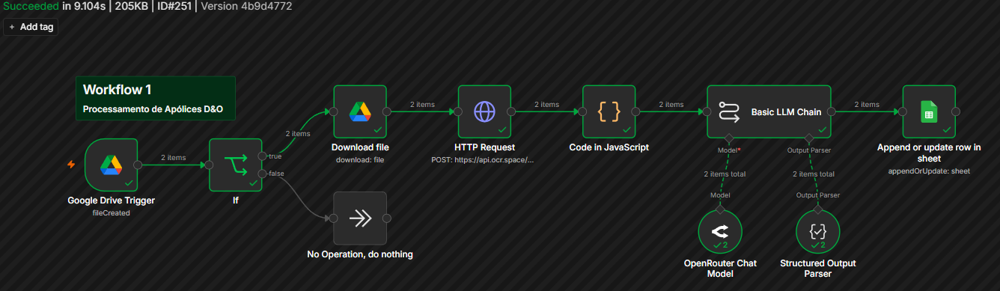
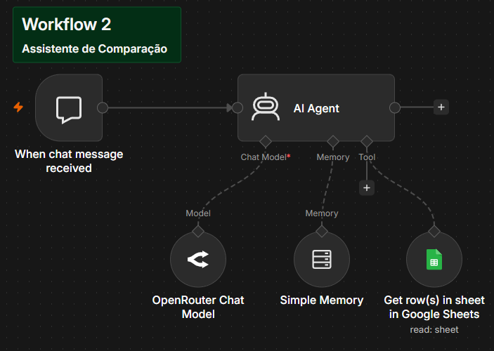

# GenAI Seguros - Plataforma Inteligente para Análise e Comparação de Apólices D&O

> **Projeto de Conclusão de Curso - InsurMinds / I2A2 (Instituto de Inteligência Artificial Aplicada)**  
> 🔗 **[Acessar a Aplicação Web em Produção](https://raguiareng.github.io/n8n-policy-comparator/)**  
> 📄 **[Relatório Técnico Completo](technical_report.md)**

---

## 👥 Integrantes do Grupo

| Nome	| E-mail |
| --- | --- |
| Bruno Corrêa	| correabruno321@gmail.com |
| [Jhiovana Silva Ribeiro](https://github.com/jhsribeiro)	| jhiovanasilva11@gmail.com |
| Luis R G Pereira	| luisrgpereira@gmail.com |
| [Rodrigo Medeiros Costa](https://github.com/rodrigomdc)	| eng.rodrigomdc@gmail.com |
| [Rodrigo Souza Aguiar](https://github.com/RAguiarEng)	| rodrigo_souza_aguiar@hotmail.com |

---

## 📖 Descrição do Projeto

O **GenAI Seguros** é um protótipo funcional (MVP) baseado em Inteligência Artificial Generativa, desenvolvido para automatizar a extração, organização e comparação de informações presentes em apólices de seguro D&O (*Directors and Officers*). 

Documentos securitários e apólices D&O são caracterizados por grande extensão, heterogeneidade de formatação e linguagem jurídica complexa. O processo tradicional de análise comparativa demanda horas de trabalho minucioso de corretores e subscritores. Nossa plataforma resolve esse gargalo através de uma arquitetura orientada a eventos e componentes inteligentes especializados:
1. **Recepção e Upload:** Ingestão simplificada de múltiplos documentos (PDF, PNG, JPEG, TIFF) com preservação de nomenclatura.
2. **Extração e OCR:** Conversão de arquivos físicos/digitais em texto bruto via API de OCR.
3. **Estruturação por LLM:** Extração determinística de campos-chave (Seguradora, Segurado, Limite Máximo de Indenização e Vigência) com parser JSON e tratamento de campos ausentes.
4. **Persistência Tabular:** Gravação e atualização idempotente em planilha Google Sheets (`Base_Apolices_DO`).
5. **Assistente de Comparação:** Agente de IA (*AI Agent*) integrado ao chat web com acesso à ferramenta (*Tool Calling*) da base de dados, permitindo consultas e comparações entre apólices em linguagem natural.

---

## 📦 Entregáveis do Projeto Final

Conforme os requisitos estabelecidos para o Projeto Final, a entrega é composta por:

1. **Relatório Técnico:** Documento detalhado com arquitetura, justificativas, tecnologias, limitações e evolução futura ([technical_report.md](technical_report.md) e versão em PDF gerada).
2. **Código-Fonte e Workflows:** Repositório público no GitHub contendo o frontend web, scripts de configuração e os fluxos exportados em JSON na pasta `workflows/`.
3. **Apresentação (Pitch Deck):** Arquivo `InsurMinds_Projeto_Final.pptx` localizado na pasta de artefatos.
4. **Vídeo Demonstrativo:** Demonstração em vídeo com duração de até 5 minutos abordando problema, arquitetura, execução da solução e resultados obtidos (`InsurMinds_Projeto_Final.mp4`).
5. **Pasta de Artefatos:** Diretório dedicado `Projeto_Final_Artefatos/` no repositório para centralizar os arquivos de entrega.

---

## 📚 Fontes de Dados e Apólices de Teste

Para validação e testes da plataforma, foram utilizados modelos de apólices e condições gerais alinhados à regulamentação da **SUSEP (Superintendência de Seguros Privados)** e ao padrão de mercado D&O:
- **Apólice Alfa (`Apolice_Alfa.pdf`):** Apólice corporativa de teste com limites de indenização e cláusulas padrão.
- **Apólice Beta (`Apolice_Beta.pdf` / `Apolice_Beta.png`):** Apólice de comparação com diferentes vigências, seguradora e valor de LMI, utilizada para validação de leitura em imagem e PDF.

---

## 🏗️ Arquitetura da Solução

A arquitetura adota uma abordagem em camadas com separação clara de responsabilidades (*Separation of Concerns*), distribuída em 3 workflows modulares no **n8n**:

```text
[ Usuário ] 
    │
    ├─► 1. Upload de Documentos (Frontend / Form Trigger)
    │        │
    │        ▼
    │   [ Workflow 3: Upload ] ──► Salva na pasta "Entrada" do Google Drive
    │
    ├─► 2. Ingestão Assíncrona & OCR (Google Drive Polling Trigger - 5 min)
    │        │
    │        ▼
    │   [ Workflow 1: Ingestão ]
    │        │
    │        ├─► Download do arquivo (PDF / PNG / JPG / TIFF)
    │        ├─► OCR.space API (Extração de texto bruto)
    │        ├─► Code JS (Consolidação de texto em lote - $input.all())
    │        ├─► LLM Chain + Structured Output Parser (Extração JSON)
    │        └─► Google Sheets (Base_Apolices_DO / aba "Dados" - appendOrUpdate)
    │
    └─► 3. Consulta e Comparação Interativa
             │
             ▼
        [ Workflow 2: Assistente de Chat ]
             │
             ├─► Chat Trigger (Frontend Web / @n8n/chat)
             ├─► AI Agent + Window Buffer Memory (5 contextos)
             ├─► Tool Calling: Google Sheets Tool (Leitura da aba "Dados")
             └─► Resposta comparativa formatada em Linguagem Natural
```

---

## 🔄 Workflows no n8n

### Workflow 1: Processamento e Estruturação de Apólices D&O
- **Arquivo:** [`workflows/workflow01.json`](workflows/workflow01.json)
- **Função:** Monitora a pasta `Entrada` do Google Drive a cada 5 minutos, valida o tipo MIME, realiza o download, envia à API do OCR.space, consolida o texto de múltiplas páginas via JavaScript (`$input.all()`), executa a extração estruturada via LLM com *Structured Output Parser* e grava/atualiza a linha correspondente no Google Sheets utilizando o nome do arquivo como chave primária.



### Workflow 2: Assistente de Consulta e Comparação D&O
- **Arquivo:** [`workflows/workflow02.json`](workflows/workflow02.json)
- **Função:** Atua como o backend do chat web. Conecta o gatilho `When chat message received` a um nó `AI Agent`, que possui memória contextual (`Simple Memory` - 5 interações) e uma ferramenta de consulta (`Google Sheets Tool`) vinculada à aba `Dados`. O agente analisa os dados extraídos das apólices e gera respostas comparativas objetivas.



### Workflow 3: Upload de Apólices
- **Arquivo:** [`workflows/workflow03.json`](workflows/workflow03.json)
- **Função:** Disponibiliza um `n8n Form Trigger` público para envio de múltiplos arquivos. Um nó de código JavaScript extrai os binários recebidos e realiza o upload para a pasta `Entrada` do Google Drive, mantendo o nome do arquivo para rastreabilidade.


---

## 🛠️ Tecnologias Utilizadas

| Camada | Tecnologia | Descrição / Função no Projeto |
| :--- | :--- | :--- |
| **Orquestração de Workflows** | **n8n** (Self-Hosted) | Motor central de automação e integração, executado na Oracle Cloud Infrastructure (OCI) sob o domínio `bot.rsa.ia.br`. |
| **Visão Computacional (OCR)** | **OCR.space API** | Conversão de documentos digitalizados e imagens em texto textual legível. |
| **Modelos de Linguagem (LLMs)** | **OpenRouter API** | Gateway unificado de inferência. Modelos utilizados: `nvidia/nemotron-3-super-120b-a12b:free` (extração estruturada), `cohere/north-mini-code:free` (agente com inferência ultrarrápida) e `meta-llama/llama-3.1-8b-instruct:free` (estratégia de fallback com suporte robusto a *Tool Calling*). |
| **Armazenamento de Documentos** | **Google Drive** | Repositório de arquivos brutos (pasta `Entrada`) com gatilho de monitoramento de novos arquivos. |
| **Banco de Dados Tabular** | **Google Sheets** | Planilha `Base_Apolices_DO` (aba `Dados`) utilizada para armazenamento estruturado e consulta rápida do agente. |
| **Frontend Web** | **HTML5, CSS3, JavaScript** | Interface responsiva e moderna com widget `@n8n/chat` integrado, desacoplada via `config.js`. |
| **Hospedagem Web** | **GitHub Pages** | Servidor estático seguro e gratuito para distribuição da interface do usuário. |

---

## 🧠 Justificativas Arquiteturais

1. **Desacoplamento Frontend/Backend (`config.js`):** A interface web estática foi totalmente desacoplada da lógica do n8n. Todas as variáveis de conexão (URLs de webhook do chat e formulário de upload) estão centralizadas em `config.js`, permitindo migração de ambiente sem alteração no código HTML/CSS.
2. **Processamento em Lote (Batch Handling):** O nó JavaScript no Workflow 1 foi projetado para iterar sobre `$input.all()`, tratando arrays de páginas retornadas pelo OCR.space e garantindo que múltiplos uploads concorrentes sejam processados sem perda de contexto.
3. **Resiliência a Falhas de Extração e Anti-Alucinação:** O prompt do extrator instrui o modelo a retornar `"Não encontrado"` caso um campo não esteja evidente no texto do OCR. Da mesma forma, o AI Agent é instruído a nunca inventar dados ausentes na planilha, garantindo confiabilidade jurídica.
4. **Estratégia de Fallback para Resiliência de APIs:** Devido à variabilidade de *rate limits* e disponibilidade de modelos em camadas gratuitas, a arquitetura foi desenhada para permitir a substituição transparente do provedor/modelo de LLM via OpenRouter.
5. **Sincronia de Contratos (Desativação de Streaming):** A instância do n8n na OCI opera atrás de um proxy reverso que realizava *buffering* dos pacotes Server-Sent Events (SSE). O streaming causava fragmentação e corrupção do JSON recebido pelo frontend (`SyntaxError`). A desativação do streaming no *Chat Trigger* e no *AI Agent* estabilizou a entrega atômica das mensagens.
6. **Mitigação de Timeout e Alucinações por Keepalive:** O n8n envia pacotes `{ "type": "keepalive" }` após 15 segundos de espera, o que gerava respostas incoerentes no frontend. A adoção de modelos de inferência ultrarrápida (< 10 segundos), como o `cohere/north-mini-code`, eliminou o disparo de *keepalive*.
7. **Compatibilidade Rigorosa de Tool Calling:** Foi verificado que certos modelos falham ao estruturar os argumentos para chamadas de ferramentas no n8n (ex: omitindo parâmetros obrigatórios). A escolha do modelo do agente e de seu fallback priorizou modelos com validação estrita de esquema de ferramentas (como Llama 3.1).

---

## ⚙️ Instruções de Instalação e Execução

### Pré-requisitos
- Instância do **n8n** (versão 1.x ou superior) com acesso externo para webhooks.
- Contas e credenciais configuradas:
  - Google Cloud Console (OAuth2 para **Google Drive** e **Google Sheets**).
  - Chave de API da **OCR.space**.
  - Chave de API do **OpenRouter**.

### 1. Configuração do Backend (n8n)
1. Acesse o seu painel do n8n e vá em **Workflows > Import from File**.
2. Importe os três arquivos da pasta `workflows/`:
   - `workflow01.json`
   - `workflow02.json`
   - `workflow03.json`
3. Configure as credenciais no n8n vinculando suas chaves de API e contas Google.
4. Na sua conta Google Drive, crie uma pasta chamada `Entrada` e capture seu ID.
5. No Google Sheets, crie uma planilha chamada `Base_Apolices_DO` com uma aba chamada `Dados` contendo os cabeçalhos:
   `Arquivo` | `Seguradora` | `Segurado` | `Limite_Indenizacao` | `Vigencia`
6. Atualize os nós dos workflows com os respectivos IDs da sua pasta e planilha.
7. Ative os três workflows (`Active = True`).

### 2. Configuração do Frontend
1. Clone este repositório:
   ```bash
   git clone https://github.com/RAguiarEng/n8n-policy-comparator.git
   ```
2. Crie o arquivo `config.js`, conforme [`config_example.js`](config_example.js), e insira as URLs dos webhooks de produção geradas pelo n8n:
   ```javascript
   const AppConfig = {
       googleDriveUrl: "https://SEU_N8N/form/SEU_FORM_ID",
       n8nWebhookUrl: "https://SEU_N8N/webhook/SEU_WEBHOOK_ID/chat"
   };
   ```
3. Hospede os arquivos estáticos (`index.html`, `style.css`, `config.js`) em qualquer servidor web ou ative o **GitHub Pages** nas configurações do repositório.

---

## 📁 Estrutura do Repositório

```text
n8n-policy-comparator/
├── .gitignore
├── config.js                     # Configuração dinâmica de endpoints (Webhook/Form)
├── favicon.ico / favicon.svg     # Ícones da aplicação
├── index.html                    # Interface principal do usuário (Landing Page e Chat)
├── style.css                     # Folha de estilos e design system da aplicação
├── README.md                     # Documentação principal do repositório
├── technical_report.md           # Relatório técnico completo do projeto final
├── img/                          # Imagens e capturas dos workflows
│   ├── analise-documentos.webp
│   ├── workflow01_pt.png
│   ├── workflow02_pt.png
│   └── workflow03_pt.png
├── workflows/                    # Workflows exportados do n8n em JSON
│   ├── workflow01.json           # Workflow 1: Ingestão, OCR e Estruturação
│   ├── workflow02.json           # Workflow 2: Assistente de Consulta e Comparação
│   └── workflow03.json           # Workflow 3: Upload de Apólices
└── issues/                       # Artefatos obrigatórios de conclusão do curso
    ├── InsurMinds_Projeto_Final.pptx           # Apresentação Pitch Deck
    ├── InsurMinds_Projeto_Final.mp4            # Vídeo demonstrativo (máx. 5 min)
    └── Relatorio_Tecnico_GenAI_Seguros.pdf     # Relatório técnico em PDF
```

---

## ⚠️ Limitações Conhecidas

- **OCR Gratuito:** O plano gratuito do OCR.space possui limitações de taxa e pode apresentar menor precisão ou truncamento em documentos extensos com mais de 3 páginas ou baixa resolução.
- **Intervalo de Polling do Google Drive:** O gatilho de novos arquivos opera em ciclo de polling a cada 5 minutos, não constituindo um processamento estritamente em tempo real.
- **Escopo do Esquema Estruturado:** O MVP prioriza a extração dos 4 pilares fundamentais (Seguradora, Segurado, Limite e Vigência). Sublimites, franquias e exclusões específicas permanecem como oportunidade de evolução.
- **Normalização de Dados:** Os valores e períodos são armazenados no formato textual extraído, sem normalização cambial ou formatação estrita de datas.
- **Interferência de Proxy Reverso em Streaming:** Ambientes de nuvem com buffering em proxies reversos exigem a desativação do modo streaming nos nós de chat.

---

## 🚀 Oportunidades de Evolução Futura

- **Arquitetura RAG com Banco Vetorial:** Integração de banco de dados vetorial (ex: Pinecone ou Qdrant) para buscas semânticas profundas em cláusulas e condições gerais completas.
- **OCR de Alta Performance:** Migração para serviços especializados em documentos jurídicos (ex: Azure Document Intelligence ou AWS Textract).
- **Normalização e Tipagem de Dados:** Criação de rotinas para conversão automática de moedas, cálculo de valores segurados e normalização temporal de vigências.
- **Controle de Acesso e LGPD:** Implementação de autenticação de usuários, segregação de dados por corretora e políticas estritas de retenção e privacidade de dados sensíveis.

---

## 📄 Licença

Este projeto está sob a [licença **MIT**](LICENSE).