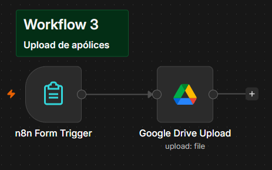
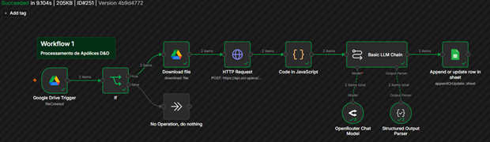
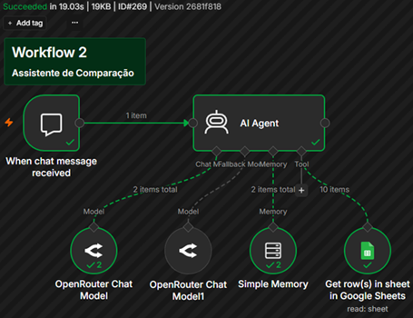

# Relatório Técnico - GenAI Seguros

## Plataforma Inteligente para Análise e Comparação de Apólices D&O

**Projeto de Conclusão de Curso - InsurMinds / I2A2**  
**Versão:** 1.0  
**Data:** 5 de outubro de 2026  
**Repositório público:** [https://github.com/RAguiarEng/n8n-policy-comparator](https://github.com/RAguiarEng/n8n-policy-comparator)  
**Aplicação web em produção:** [https://raguiareng.github.io/n8n-policy-comparator/](https://raguiareng.github.io/n8n-policy-comparator/)
**Apresentação Pitch Deck `.pptx`**: [InsurMinds_Projeto_Final.pptx](Projeto_Final_Artefatos/InsurMinds_Projeto_Final.pptx)

**Vídeo Demonstrativo `.mp4`**: [InsurMinds_Projeto_Final.mp4](https://docs.google.com/videos/d/1fa3IZjEfNTuKBnBf14VcjKYzl4_bJVsLcq8zCvDCQug/play)

---

### Integrantes do Grupo

| Nome | E-mail | GitHub |
| :--- | :--- | :--- |
| Bruno Corrêa | correabruno321@gmail.com | — |
| Jhiovana Silva Ribeiro | jhiovanasilva11@gmail.com | [@jhsribeiro](https://github.com/jhsribeiro) |
| Luis R G Pereira | luisrgpereira@gmail.com | — |
| Rodrigo Medeiros Costa | eng.rodrigomdc@gmail.com | [@rodrigomdc](https://github.com/rodrigomdc) |
| Rodrigo Souza Aguiar | rodrigo_souza_aguiar@hotmail.com | [@RAguiarEng](https://github.com/RAguiarEng) |

---

## Resumo Executivo

O **GenAI Seguros** é um protótipo funcional para receber apólices de seguro D&O (*Directors and Officers*) em PDF ou imagem, extrair informações relevantes e permitir consultas e comparações em linguagem natural. A solução reduz o trabalho de localizar manualmente dados recorrentes em documentos extensos e heterogêneos, sem substituir a avaliação técnica de corretores, subscritores ou profissionais jurídicos.

O MVP combina três workflows no n8n, OCR, modelos de linguagem acessados pelo OpenRouter, Google Drive, Google Sheets e uma interface web estática. A implementação separa upload, processamento e consulta. O fluxo estruturado registra quatro campos: seguradora, segurado, limite máximo de indenização e vigência. O assistente consulta essa base antes de responder e informa quando um dado não foi encontrado.

## 1. Problema e objetivo

Apólices D&O apresentam linguagem técnica, variações de formato e informações distribuídas em diferentes páginas. Comparar alternativas exige localizar dados, normalizar termos e conferir diferenças, processo sujeito a demora e erro humano.

O objetivo do projeto é demonstrar um MVP que:

1. receba documentos em PDF, PNG, JPEG ou TIFF;
2. extraia seu conteúdo textual automaticamente;
3. converta parte do conteúdo em dados estruturados com IA generativa;
4. armazene os resultados de forma consultável;
5. compare ao menos duas apólices por meio de uma interface em linguagem natural; e
6. apresente ausências de dados sem inventar informações.

## 2. Arquitetura da solução

A arquitetura é orientada a eventos e dividida em cinco camadas:

| Camada | Componentes | Responsabilidade |
| --- | --- | --- |
| Interface | HTML5, CSS3, JavaScript e widget `@n8n/chat` | Apresentar o produto, encaminhar o upload e disponibilizar o chat |
| Orquestração | n8n self-hosted na OCI | Executar os workflows e integrar serviços externos |
| Documentos e OCR | Google Drive e OCR.space | Receber arquivos, armazená-los e converter PDF/imagem em texto |
| Inteligência artificial | OpenRouter e modelos de linguagem | Estruturar o texto e formular consultas/comparações |
| Persistência | Google Sheets | Manter uma base tabular simples das apólices processadas |

### 2.1 Visão lógica

```text
Usuário
  |-- envia arquivos --> Formulário n8n (Workflow 3)
  |                          |
  |                          v
  |                    Pasta Entrada / Google Drive
  |                          |
  |                          v
  |               Trigger por polling (Workflow 1)
  |                          |
  |             download -> OCR.space -> texto consolidado
  |                          |
  |                          v
  |              LLM + parser de saída estruturada
  |                          |
  |                          v
  |                 Google Sheets / aba Dados
  |                          ^
  |                          |
  `-- pergunta --> Chat web -> Agente comparador (Workflow 2)
```

### 2.2 Implantação

O frontend é publicado no GitHub Pages. Os endpoints de formulário e chat apontam para uma instância n8n self-hosted na Oracle Cloud Infrastructure (OCI), sob o domínio `bot.rsa.ia.br`. O n8n concentra a lógica de integração e mantém as credenciais dos serviços em seu cofre de credenciais. Google Drive e Google Sheets funcionam, respectivamente, como repositório de entrada e persistência tabular do MVP.

## 3. Tecnologias utilizadas

| Tecnologia | Uso no projeto | Motivo da escolha |
| --- | --- | --- |
| n8n | Orquestração dos três workflows | Integração visual, exportação em JSON e rapidez de prototipação |
| Oracle Cloud Infrastructure | Hospedagem da instância n8n | Disponibilidade de ambiente self-hosted para a equipe |
| Google Drive | Recepção e armazenamento dos documentos | Integração nativa com n8n e gatilho de novos arquivos |
| OCR.space API | OCR de PDFs e imagens | Serviço simples, acessível por HTTP e adequado ao MVP |
| OpenRouter | Acesso aos modelos generativos | Possibilidade de trocar modelos com baixa alteração no fluxo |
| Nemotron | Extração estruturada e respostas do agente | Modelos configurados nos workflows por meio do OpenRouter |
| Google Sheets | Base estruturada | Inspeção simples, baixo custo operacional e integração nativa |
| HTML5, CSS3 e JavaScript | Interface web | Publicação leve, sem etapa de build |
| `@n8n/chat` | Conversa com o agente | Integração direta com o Chat Trigger do n8n |
| GitHub Pages | Hospedagem do frontend | Publicação estática ligada ao repositório público |

No workflow de extração, o modelo configurado é `nvidia/nemotron-3-super-120b-a12b:free`, com temperatura zero, resposta JSON e até três tentativas. No agente de comparação, o modelo principal configurado é o `cohere/north-mini-code:free` (escolhido por sua baixíssima latência), com uma estratégia de *Fallback* apontando para o `poolside/laguna-xs-2.1:free` (escolhido por sua alta confiabilidade em *Tool Calling*). Como modelos gratuitos podem mudar de disponibilidade ou sofrer limites de taxa, essas identificações representam a configuração otimizada do repositório na data deste relatório.

## 4. Agentes e componentes inteligentes

### 4.1 Extrator estruturado de apólices

O primeiro componente inteligente recebe o texto produzido pelo OCR e atua como especialista em seguros D&O. Seu prompt determina que o modelo extraia somente informações presentes no documento, use `Não encontrado` quando não houver evidência e retorne JSON.

Um *Structured Output Parser* impõe o seguinte contrato:

```json
{
  "Seguradora": "Nome da seguradora",
  "Segurado": "Nome da empresa ou pessoa segurada",
  "Limite_Indenizacao": "Valor do limite máximo de indenização (LMI)",
  "Vigencia": "Período de vigência da apólice"
}
```

Esse componente é implementado como uma cadeia LLM, e não como agente autônomo: recebe uma tarefa definida, processa o texto e devolve uma estrutura fixa.

### 4.2 Agente de consulta e comparação

O segundo componente inteligente é um agente n8n conectado ao chat. Ele recebe perguntas em português e dispõe de uma ferramenta para ler linhas da aba `Dados` no Google Sheets. A instrução de sistema obriga a consulta à ferramenta sempre que a pergunta envolver apólices, seguradoras, limites ou vigências, restringe a resposta aos dados retornados e orienta a declarar bases vazias ou campos não encontrados.

Uma memória de janela simples mantém o contexto recente da conversa. O agente não acessa o PDF original; suas respostas são baseadas nos campos previamente extraídos.

### 4.3 Limites do uso do termo “agente”

Para precisão arquitetural, apenas o workflow de consulta utiliza o nó **AI Agent** e seleção de ferramenta. O workflow de ingestão utiliza uma cadeia LLM com saída estruturada. Ambos usam IA generativa, mas têm graus diferentes de autonomia.

## 5. Fluxo completo de processamento

### 5.1 Upload - Workflow 3

1. O usuário acessa o botão **Enviar apólice** no site.
2. O formulário n8n aceita um ou mais arquivos.
3. Um nó JavaScript percorre os binários recebidos e cria um item por arquivo.
4. Cada item é enviado para a pasta de entrada no Google Drive.



### 5.2 Ingestão e estruturação - Workflow 1

1. O Google Drive Trigger verifica a pasta a cada cinco minutos.
2. Um filtro aceita `application/pdf`, `image/jpeg`, `image/png` e `image/tiff`; outros formatos seguem para um nó sem operação.
3. O arquivo válido é baixado pelo n8n.
4. Uma requisição multipart envia o binário à OCR.space.
5. Um nó JavaScript concatena o texto das páginas retornadas no lote.
6. A cadeia LLM recebe o texto e produz os quatro campos do contrato JSON.
7. O parser valida a forma da saída.
8. O Google Sheets executa `appendOrUpdate`, usando o nome do arquivo como chave, o que reduz duplicações em reprocessamentos.



### 5.3 Consulta e comparação - Workflow 2

1. O usuário abre o assistente na página web.
2. O Chat Trigger envia a mensagem ao agente.
3. O agente consulta a ferramenta do Google Sheets.
4. O modelo interpreta as linhas retornadas e responde em português.
5. Para uma comparação, o usuário pode pedir diferenças de limite e vigência entre duas ou mais apólices processadas.



## 6. Modelo de dados e contrato entre componentes

A aba `Dados` utiliza uma linha por arquivo e cinco colunas:

| Campo | Origem | Finalidade |
| --- | --- | --- |
| `Arquivo` | Nome no Google Drive | Identificador para atualização da linha |
| `Seguradora` | Extração por LLM | Identificar a emissora |
| `Segurado` | Extração por LLM | Identificar a pessoa ou empresa segurada |
| `Limite_Indenizacao` | Extração por LLM | Apoiar comparação de limites |
| `Vigencia` | Extração por LLM | Apoiar comparação de períodos |

O MVP preserva valores como texto. Isso facilita a demonstração, porém limita ordenação numérica, validação monetária e comparação normalizada de datas.

## 7. Decisões arquiteturais e justificativas

### Separação de responsabilidades

Upload, ingestão e consulta são workflows independentes. Essa divisão reduz acoplamento, permite testar cada etapa isoladamente e facilita a substituição de serviços.

### Processamento assíncrono

O upload encerra após gravar os arquivos no Drive; a extração ocorre posteriormente pelo gatilho de polling. A interface informa que o processamento pode levar cerca de cinco minutos ou mais, evitando prometer resposta imediata.

### Saída estruturada e baixa temperatura

O contrato JSON e a temperatura zero reduzem variações na extração. A regra `Não encontrado` torna lacunas visíveis e diminui a pressão para o modelo completar informações ausentes.

### Persistência simples para um MVP

Google Sheets permite inspeção manual pela equipe e integração direta com o agente. Para o volume de demonstração, essa simplicidade foi priorizada sobre um banco relacional ou vetorial.

### Interface desacoplada

O frontend é independente do n8n e concentra URLs operacionais em `config.js`. Isso permite publicar a interface como site estático e alterar endpoints sem modificar a marcação principal.

### Modelos substituíveis

O OpenRouter desacopla os workflows de um único provedor. A equipe pode trocar o modelo configurado caso haja indisponibilidade, limite de uso ou necessidade de melhor qualidade.

### Sincronia de Contratos (Desativação de Streaming)
O n8n está hospedado na Oracle Cloud (OCI) atrás de um Proxy Reverso Caddy (via docker compose). Durante os testes, notou-se que o proxy realizava *buffering* dos pacotes de streaming, entregando um JSON concatenado e inválido ao frontend, o que gerava um `SyntaxError`. A decisão arquitetural foi desativar o streaming tanto no *Chat Trigger* quanto no *AI Agent*, garantindo a entrega da resposta em um bloco único e íntegro.

### Prevenção de Timeout e Alucinações
O n8n possui um mecanismo de proteção que envia um sinal `{ "type": "keepalive" }` caso o processamento ultrapasse o _timeout_. Esse sinal entrava em conflito com o frontend estático e induzia o LLM a alucinações (ex: o modelo inventava que precisava "ajustar o código do servidor" para justificar a demora). A solução foi adotar _fallback_.

### Compatibilidade de Tool Calling no Fallback
Ao configurar modelos de contingência para contornar *Rate Limits* da API gratuita, identificamos que alguns LLMs falham ao formatar o JSON de requisição para a ferramenta do Google Sheets (omitindo o parâmetro obrigatório `id`). A arquitetura exige que tanto o modelo principal quanto o fallback tenham suporte nativo e comprovado a *Tool Calling* (como a família Llama 3.1).

## 8. Confiabilidade, segurança e uso responsável

O projeto adota controles iniciais de confiabilidade: filtragem de MIME type, prompt contra invenção, saída estruturada, consulta obrigatória à base e aviso na interface de que o sistema não substitui análise profissional.

As credenciais do Google e APIs devem permanecer no gerenciador de credenciais do n8n e nunca ser incluídas nos JSONs exportados ou no repositório. A instância n8n administrativa possui acesso restrito, enquanto formulário e webhook necessários à demonstração são endpoints públicos.

Como os documentos podem conter dados pessoais, empresariais e informações sensíveis de risco, uma implantação produtiva exigiria base legal e controles compatíveis com a LGPD: autenticação, autorização por usuário, retenção definida, exclusão, criptografia, trilha de auditoria, minimização dos dados e revisão dos contratos com subprocessadores.

As respostas do assistente são apoio à análise. Valores, datas, cláusulas e conclusões devem ser conferidos no texto oficial da apólice por profissional habilitado.

## 9. Limitações conhecidas

- O OCR gratuito pode falhar, truncar documentos longos ou perder conteúdo em imagens de baixa qualidade.
- O gatilho do Google Drive tem tempo de espera de cinco minutos; o processamento não é em tempo real e a página não exibe status por arquivo.
- A extração estruturada cobre somente seguradora, segurado, limite de indenização e vigência. Coberturas, exclusões, franquias, sublimites e cláusulas ainda não integram o contrato de dados.
- Limites e vigências são armazenados como texto, sem normalização de moeda, período ou fuso.
- O agente compara a planilha, não o conteúdo integral da apólice, e pode perder contexto que o esquema não preservou.
- Não há, no repositório, testes automatizados, conjunto de avaliação rotulado ou métricas de precisão de OCR/extração.
- Não há indicação de autenticação do usuário final, segregação de dados por cliente ou controle granular de acesso.
- Serviços gratuitos e modelos do OpenRouter estão sujeitos a latência, limite de taxa e descontinuação.
- O nome do arquivo é a chave de atualização; arquivos diferentes com o mesmo nome podem sobrescrever a mesma linha. Por isso, `timestamp` é adicionado ao nome via `JavaScript` no workflow 01.
- As integrações dependem de serviços externos e de configuração manual de IDs e credenciais após a importação dos workflows.
- **Interferência de Proxy Reverso em Webhooks:** O uso do n8n atrás de proxies na nuvem (como na OCI) pode interferir no envio de pacotes fragmentados (Server-Sent Events / Streaming), exigindo adaptações no modo de resposta (*Response Mode*) para garantir a estabilidade da interface de chat.

## 10. Possibilidades de evolução

1. Expandir o esquema para coberturas, exclusões, franquias, sublimites, retroatividade, territorialidade e cláusulas relevantes.
2. Normalizar moedas, valores e datas, mantendo também o trecho-fonte e o número da página para rastreabilidade.
3. Adicionar revisão humana, nível de confiança e evidências lado a lado com cada campo extraído.
4. Implementar banco relacional para dados normalizados e armazenamento de objetos para os documentos.
5. Adotar RAG ou busca textual no conteúdo integral, com citações de página nas respostas.
6. Criar fila de processamento, retentativas, *dead-letter queue*, idempotência por hash e painel de status.
7. Medir precisão com um conjunto de apólices anotadas e testes de regressão para prompts e modelos.
8. Implementar autenticação, autorização, segregação por organização, logs e políticas de retenção/LGPD.
9. Substituir ou complementar o OCR por serviço especializado em documentos, após avaliação de custo e qualidade.
10. Gerar uma comparação visual estruturada, com destaque de diferenças e exportação de relatório.

## 11. Execução e configuração

Para reproduzir o MVP:

1. clone o repositório;
2. importe `workflows/workflow01.json`, `workflows/workflow02.json` e `workflows/workflow03.json` no n8n;
3. configure credenciais de Google Drive, Google Sheets, OCR.space e OpenRouter;
4. substitua os placeholders de pasta e planilha nos workflows;
5. publique os workflows e atualize as URLs em `config.js`;
6. sirva `index.html` e `style.css` por um servidor web ou pelo GitHub Pages;
7. envie ao menos duas apólices, aguarde a ingestão e consulte o assistente.

Os workflows exportados não devem conter segredos. A disponibilidade final também depende das permissões da pasta, da planilha e dos endpoints do n8n.

## 12. Atendimento aos requisitos do desafio

| Requisito | Evidência no projeto | Situação |
| --- | --- | --- |
| Ler PDF ou imagem | Formulário e filtro para PDF, JPEG, PNG e TIFF | Atendido |
| Extrair informações automaticamente | OCR.space seguido de cadeia LLM | Atendido |
| Estruturar os dados | Parser JSON e colunas no Google Sheets | Atendido, com escopo de quatro campos |
| Comparar ao menos duas apólices | Agente consulta várias linhas e responde pelo chat | Atendido no fluxo funcional |
| Apresentar diferenças | Interface oferece perguntas sobre limites e vigências | Atendido no escopo estruturado |
| Usar IA generativa | Dois modelos via OpenRouter | Atendido |
| Disponibilizar interface | Site no GitHub Pages, formulário e chat | Atendido |

## 13. Estrutura dos artefatos do repositório

```text
n8n-policy-comparator/
|-- index.html
|-- style.css
|-- config.js
|-- README.md
|-- technical_report.md
|-- workflows/
|   |-- workflow01.json
|   |-- workflow02.json
|   `-- workflow03.json
|-- img/
|   |-- workflow01_pt.png
|   |-- workflow02_pt.png
|   `-- workflow03_pt.png
`-- Projeto_Final_Artefatos/
    |-- InsurMinds_Projeto_Final.pptx
    |-- InsurMinds_Projeto_Final.mp4
    `-- GenAI_Seguros_InsurMinds_Projeto_Final.pdf
```

Os demais entregáveis obrigatórios do curso, como apresentação, vídeo, arquivo ZIP e pasta `Projeto_Final_Artefatos`, devem ser conferidos separadamente antes do envio.

## 14. Conclusão

O GenAI Seguros demonstra um fluxo completo de recepção, extração, estruturação e consulta de apólices D&O. A arquitetura low-code integra componentes especializados com clara separação de responsabilidades e entrega uma experiência simples ao usuário. A saída estruturada, a consulta obrigatória à base e a declaração de campos ausentes são escolhas coerentes com um MVP responsável.

O protótipo não pretende substituir análise securitária nem resolver toda a complexidade documental de D&O. Seu principal resultado é validar a integração ponta a ponta e estabelecer uma base evolutiva para extração mais ampla, rastreabilidade, avaliação quantitativa e controles de segurança adequados a um cenário produtivo.
